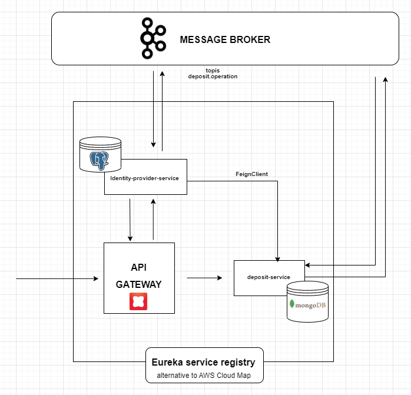
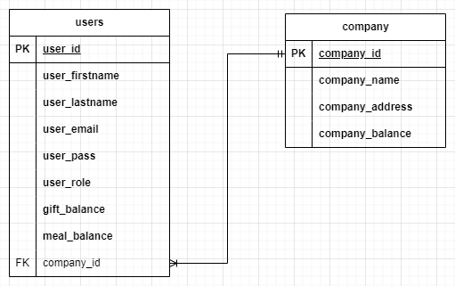

<h1 align="center"> Wedoogift Challenge</h1> <br>

<p align="center">
wedoogift is an application that provides for companies space to manage meal and gift deposits for its employees
</p>


## Table of Contents

- [Requirements](#requirements)
- [High level Architecture](#high-level-arhitecture)
- [Databases](#databases)
- [Quick Start](#quick-start)
- [Main Features](#main-features)
- [Testing](#testing)
- [Improvements](#improvements)


## Requirements
to be able to run the app you will need to install : 
* Docker (desktop for Widows with a jvm) 
* Docker-compose to run docker-compose.yml
* Maven


## High level Architecture



* It's a microservice architecture event driven,  with saga orchestration design pattern using Message broker (Kafka is this case).  

* Each microservice has its own BD - for identity provider postgres relational DB for sensitive user data - deposit : MongoDb to allow a good scalling.  

* Due to missing provider (AWS - GCP ...), i choosed to regester my microservice with eureka (other solution would be to use service embaded in K8S),  
every microservice registred will be exposed - you can check at  : http://localhost:8761/    (while app running of course).  
* a gateway is put to route users allowed to disered endpoints.  
* Message brooker : Kafka will be responsible of the update of users and company balances when a deposit is done -- an event is sent and intercepted by subscribers (identity provider)  
* A external Api calls mechanism is put to enable fetching information between microservices : i used feign Client for this purpose (other solutions Rest Template)  


## Databases

for identity provider service : postgres sql database - to expose the relation company <-> users  




for deposit : mongoDB 


## Quick Start

to run application : go to root directory where docker-compose.yml file is located and run in terminal (or a command prompt) : 

```sh
$ docker-compose up
```

verify that containers are running : 

```sh
$ docker ps
```


local running :  

### IF YOU HAVE PROBLEMS RUNNING THE docker-compose.yml FILE - i have a trick (not good practice though :p !)

run on each project :  

```sh
$ mvn clean install
```

```sh

$ mvn spring-boot:run
```

then:  
run only docker-compose for data bases and kafka/zookeeper ( i will leave a docker compose file in each service just in case -> Waring : don't EVER do that xD)  


### Quick Acces to Apis : 

SWAGGER :

for deposit -> http://localhost:8081/swagger-ui/index.html
for identity-provider -> http://localhost:8082/swagger-ui/index.html


## Main Features

to understand the product - we trace this scenario :  

A user Admin from a company do a deposit for a specific user with a specifi amount :  
  two checks are there : user exist && amount <= COmpany balance  
  if condition are there : we proceed to a save into data base of the record  
  then an event is sent to identity provider to update company and user's balance accordinaly  
  


## Testing

* Integration tests are put in place to have an end to end test using testContainers to have Databases up and also Kafka broker and zookeeper.

## Improvements

Due to lack of time from my side:  

* for database : more granular 
* add security : JWT token login based 
* i would rather user a k8s cluster
* I would use some reactive programming for when we have big amount of data to fetch

